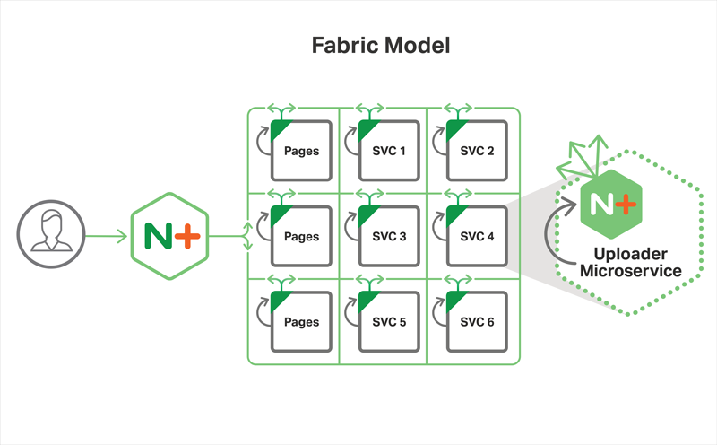
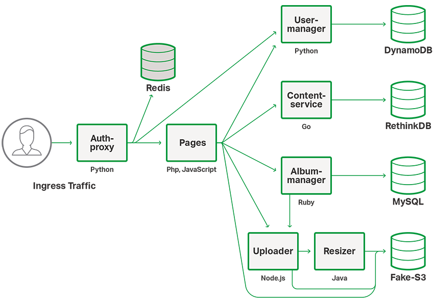

# Ingenious
_Ingenious_ is a photo-sharing demo app created by NGINX to show the Fabric Model approach to application development. The app is designed to allow the user to login to a personalized account, and then store, view and delete their own pictures. It also includes a blog in which users can view the latest news and updates within the application.



The _Ingenious_ application is built with microservices and utilizes their inherent benefits to generate a robust, stable, independent, polyglot environment.

Specifically, the app is designed using the [Fabric Model](https://www.nginx.com/blog/microservices-reference-architecture-nginx-fabric-model/) - the most sophisticated architecture in the [MRA](https://www.nginx.com/blog/introducing-the-nginx-microservices-reference-architecture/) - to configure its services. Included in this configuration is an instance of NGINX running in every docker container. This allows for increased security without the typical decreased speed of communication between services. After an initial TLS/SSL handshake, a connection is then established and is able to be reused without any further overhead.

The Fabric Model suggests a new method of application development. Because NGINX Plus is running on both ends of every connection, capabilities of each service become a function of the app's network rather than capabilities of specific services or servers. NGINX Plus allows this network to be persistent, fast, and stable.



The _Ingenious_ application employs seven different services in order to create its functionality.

Pages is the foundational service built in PHP upon which the other services provide functionality. Pages makes calls directly to User Manager, Album Manager, Content Service, and Uploader.

User Manager is built completely using Python and backed by DynamoDB. It's use is to store and modify user information, allowing the app a login system. Login is done with Google and Facebook through OAuth, but also includes a system for local login when testing the system.

Album Manager is built using Ruby and backed by MySQL, and allows the user to upload albums of multiple images at once. Album Manager makes calls to the Uploader service and therefore the Resizer to upload and modify images specified by the user.

The Uploader service is built using Javascript and is used to upload images to an S3 bucket. Uploader then makes calls to the Resizer service with the previously generated id of the image within S3, and Resizer then makes copies of the image with size "Large", "Medium", and "Thumbnail".

Content Service is built in Go and backed by RethinkDB. The Content Service provides, retrieves, and displays content for the NGINX _Ingenious_ application

Auth Proxy is a Python app that utilizes Redis' capabilities as a caching server. Making direct connections to both Pages and User Manager, Auth Proxy is used to validate the user's identity. It also serves as the gateway into the application, acting as the only public-facing service within the application.

## Prerequisites

There are a few prerequisites that you need for your development environment
- [git](https://git-scm.com/book/en/v2/Getting-Started-Installing-Git)
  - Notes for Windows users:
    - There are bash scripts that are executed by the **CMD**  instruction in the Dockerfile. In order for these scripts to run, the `core.autocrlf` must be set to `input` so that the line endings are preserved. The command to set this configuration is:

    ```git config core.autocrlf input```

    - Docker for Windows must be configured to share the drive, per the discussion [here](https://github.com/docker/compose/issues/4854)
- [docker](https://store.docker.com/search?type=edition&offering=community)
  - Note for Linux users:
    - The docker-compose file for this repository uses version 3, which requires docker engine 1.13/17.04 or higher, and the docker engine that is installed with Ubuntu 16.04, the version that we used for testing. The appropriate version of docker-compose can be installed with the command below from the [docker-compose site](https://docs.docker.com/compose/install/):

    ```sudo curl -L https://github.com/docker/compose/releases/download/1.18.0/docker-compose-`uname -s`-`uname -m` -o /usr/local/bin/docker-compose```

    - For more information, check the compatibility matrix [here](https://docs.docker.com/compose/compose-file/compose-versioning/).

## Quick start
You can clone all the repositories of the NGINX _Ingenious_ application using the command below:
```
git clone --recurse-submodules https://github.com/nginxinc/mra-ingenious.git
```

Once the repositories are cloned, be sure that you have the latest versions of the submodules by running:
```
git pull
```

There are detailed instructions for building the service below, and in order to get started quickly, you can follow these simple
instructions to quickly build the image.

0. (Optional) If you don't already have an NGINX Plus license, you can request a temporary developer license
[here](https://www.nginx.com/developer-license/ "Developer License Form"). If you do have a license, then skip to the next step.
1. Copy your licenses to the **<repository-path>/<mra-service>/nginx/ssl** directory for all the services
2. Modify your _hosts_ file to include fake-s3. It should look like:
    ```
    127.0.0.1   fake-s3
    ```
3. Go to the **mra-ingenious** directory and run the command `docker-compose up`.

At this point, you will have the _Ingenious_ application running locally. You can access it in your browser with the url `https://localhost/`.

To build customized images for the different services or to set other options, please check the specific README for each service.

Three docker compose files are included with this service:
- [docker-compose.yaml](docker-compose.yaml): to run in containers on the machine where the repository has been cloned
- [docker-compose-k8s.yaml](docker-compose-k8s.yaml): to run on Kubernetes
- [docker-compose-dcos.yaml](docker-compose-dcos.yaml): to run on DC/OS

## Makefile 
A _Makefile_ has been included in the project to make the process of building and running _Ingenious_ as easy as possible. 
You can run `make <action>` to perform an action in a simple way. 
 
| Action          | Description                                                            | 
| --------------- | ---------------------------------------------------------------------- |
| build           | Builds the Ingenious Docker images with NGINX Plus                     | 
| build-oss       | Builds the Ingenious Docker images with NGINX OSS                      | 
| build-clean     | Builds the Ingenious Docker images with NGINX Plus without using cache | 
| build-clean-oss | Builds the Ingenious Docker images with NGINX OSS without using cache  | 
| run-local       | Runs the Ingenious app in a local environment                          | 
| stop            | Stop all the Ingenious app containers                                  |

## Going Forward
We intend to maintain and build on this Microservices Reference Architecture by cleaning up things we may have missed, merging your pull requests, and evolving the application as we build microservices technologies. Other examples of our work with microservices include:

- The [NGINX Plus Ingress Controller](https://github.com/nginxinc/kubernetes-ingress) for [Kubernetes](https://kubernetes.io/docs/concepts/services-networking/ingress/). This is often confused with the ingress controller built using NGINX by the Kubernetes team. You can learn about the difference [here](https://github.com/nginxinc/kubernetes-ingress/issues/190)
- The [nginmesh project](https://github.com/nginmesh), which integrates NGINX Plus as the sidecar in an Istio installation

You can also learn more about the NGINX Microservices Network Architectures on our blog:
- [The Proxy Model](https://www.nginx.com/blog/microservices-reference-architecture-nginx-proxy-model/)
- [The Router Mesh Model](https://www.nginx.com/blog/microservices-reference-architecture-nginx-router-mesh-model/)
- [The Fabric Model](https://www.nginx.com/blog/microservices-reference-architecture-nginx-fabric-model/)

As described above, the first release of the NGINX Microservices Reference Architecture, Ingenious, is built using the Fabric Model. Our next major release will include instructions for building the MRA using the Router Mesh Model.

In the meantime, we have open sourced simple builds of the [Fabric Model](https://github.com/nginxinc/fabric-model-architecture) and [Router Mesh](https://github.com/nginxinc/router-mesh-architecture). These repositories are succinct examples of using the Fabric Model and Router Mesh and focus on the NGINX configuration aspect of each.

## A Note About Security

tl;dr: The Ingenious application is designed to be a _reference architecture_ and should be run only on a local machine or private server. **Do not run in a production environment**

From the time that it was ideated, the Ingenious application was designed to be a reference architecture for building microservices-based applications using NGINX as the service mesh to facilitate communication to and among each of the microservices.

As such, our focus has been to develop an application which demonstrates the functionality described above in a simple way. In so doing, the code that we have created has not been tested for use in a production environment.

In fact, we recommend that the Ingenious application be run on a local machine or private server. If you run the application on a publicly available server, you do so at your own risk.

That being said, please have fun learning while you build microservices using NGINX!
